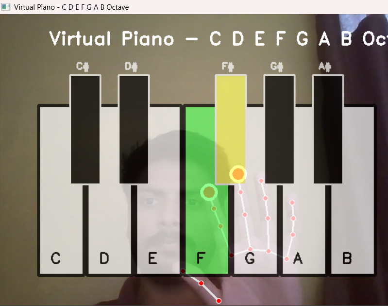

# 🎹 Virtual Piano

A hand-tracking virtual piano that lets you play music using your webcam and hand gestures!

## Screenshots




## Installation

### 1. Clone the Repository
```bash
git clone https://github.com/yourusername/virtual-piano.git
cd virtual-piano
```

### 2. Install Dependencies
```bash
pip install -r requirements.txt
```

### 3. Add Sound Files
Place your piano sound files (C4.mp3, Cs4.mp3, D4.mp3, etc.) in a folder named `tones/`

## How to Run

```bash
python piano.py
```

## How to Play

1. **Position yourself** in front of your webcam
2. **Raise your hand** so it's visible on screen
3. **Use your index and middle fingers** to touch the piano keys
4. **Press 'q'** to quit

### Piano Layout
- **White keys**: C, D, E, F, G, A, B
- **Black keys**: C#, D#, F#, G#, A#

### Tips
- Keep your hand steady for better detection
- Touch keys directly with your fingertips
- You can use both hands simultaneously!

## Requirements

- Python 3.7+
- Webcam


Enjoy making music! 🎵
